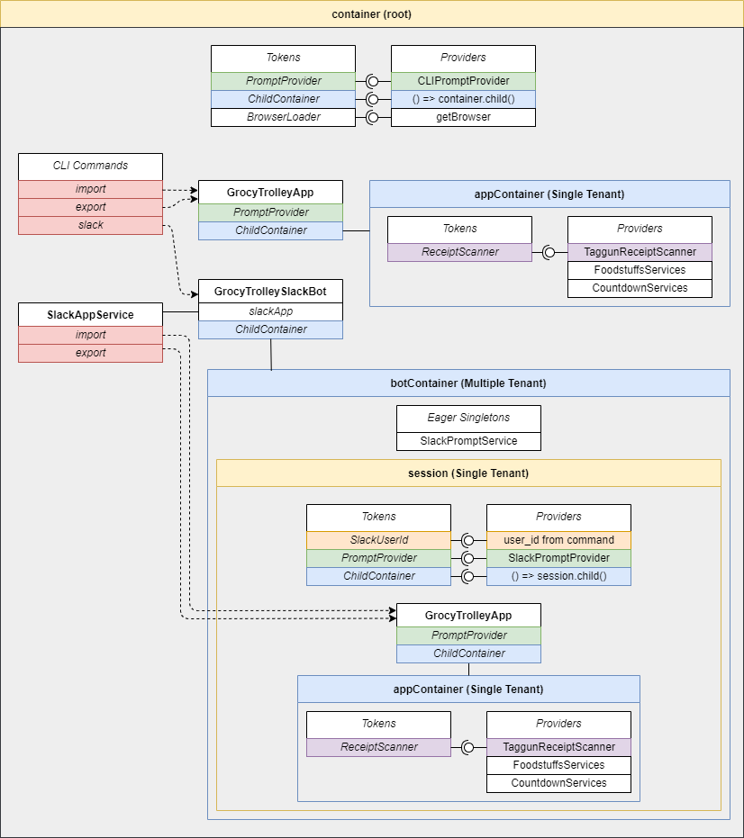

# Grocy Trolley

GrocyTrolley links [Grocy](https://github.com/grocy/grocy/) to online grocery shopping. You can:

- [`import`](#import) and stock products from online shops
- [`export`](#export) shopping lists from Grocy to online shopping orders

It has a prompt-based text interface that can be used via the command line or installed as a Slack bot.

## Commands

### Import

```
import/i [source] [options]
```

Add products to Grocy from `source` with an optional amount to add to stock.
Unknown products will be added to the database.

See import [options.ts](src\app\import\options.ts) for up-to-date definitions.

#### `[source]`

_Source of products to import/stock_

| Source     | Description                                   | Options                                |
| ---------- | --------------------------------------------- | -------------------------------------- |
| `cart`     | A Pak'n'Save online shopping cart             |                                        |
| `order`    | A Pak'n'Save online shopping order            |                                        |
| `list`     | A Pak'n'Save online shopping list             | `--list-id <uuid>`                     |
| `receipt`  | An image of a Pak'n'Save or Countdown receipt | `--file <path>`                        |
| `barcodes` | A list of barcodes                            | `--file <path>` or `--barcodes <list>` |

#### `[options]`

| Option                      | Description                |
| --------------------------- | -------------------------- |
| `-f, --file <path>`         | Path to input file         |
| `-i, --list-id <uuid>`      | ID of list to import       |
| `-b, --barcodes <barcodes>` | List of barcodes to import |
| `-h, --help`                | Display help for command   |

### Export

```
export/e [destination] [options]
```

Export a shopping list from Grocy to `[destination]`.

See export [options.ts](src\app\export\options.ts) for up-to-date definitions.

#### `[destination]`

_Online shopping site to export products to_

| Destination | Description                       |
| ----------- | --------------------------------- |
| `pns`       | A Pak'n'Save online shopping cart |
| `grocer`    | Grocer list for price comparisons |

#### `[options]`

| Option       | Description              |
| ------------ | ------------------------ |
| `-h, --help` | Display help for command |

## CLI Usage

```
grocy-trolley [command] [options]
```

### CLI Commands

The [`import`](#import) and [`export`](#export) commands listed above can be used with the command line, as well as the following:

| Command          | Description                 |
| ---------------- | --------------------------- |
| `slack`          | Starts the slack bot server |
| `help [command]` | Display help for command    |

### CLI Options

| Option                    | Description               | Choices                                           | Default |
| ------------------------- | ------------------------- | ------------------------------------------------- | ------- |
| `-V, --version`           | Output the version number |
| `-l, --log-level <level>` | Log level                 | `TRACE`, `DEBUG`, `INFO`, `WARN`, `ERROR` `DEBUG` | `DEBUG` |
| `-e, --env-file <path> `  | Path to .env file         |                                                   | `.env`  |
| `-h, --help`              | Display help              |                                                   |         |

## DI Architecture

This diagram shows the hierachy of dependency injection containers that enable `GrocyTrolleyApp` to run in a CLI session or as a Slack bot.
It also shows the tokens available in each container.
Each instance of `GrocyTrolleyApp` is scoped to a single user.
CLI commands simply use a single instance in the root container, whereas the Slack bot spawns a new child container with a `GrocyTrolleyApp` instance for each user command.

`GrocyTrolleyApp` uses a generic `PromptProvider` which can be provided by the Slack bot or by the prompts CLI library.


